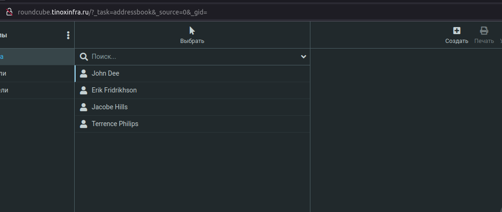
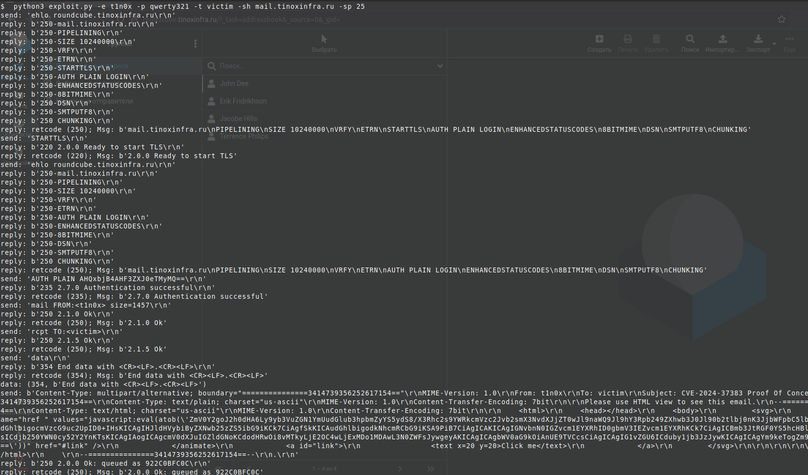
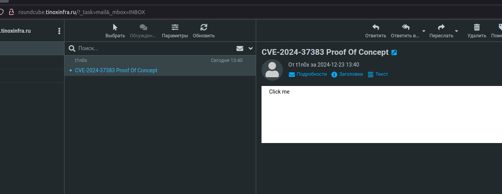
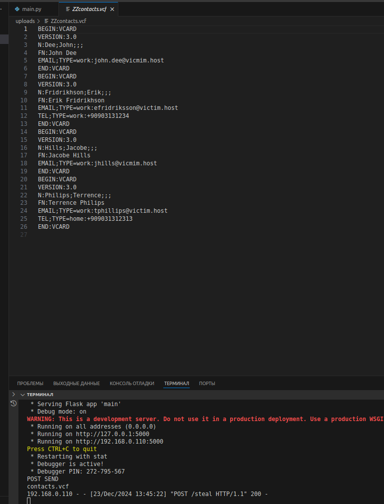

# Изучение уязвимости CVE-2024-37383

## 1. Подготовка стенда для тестирования

## Дисклеймер все действия, приведенные в рамках данной статьи несут исключительно ознакомительный характер и автор канала не несет ответсвенность за использование данного материала во вред на других системах


Для начала нам необходимо подготовить свой стенд для изучения с таким конфигом:

 1. SMTP сервер Postfix
 2. IMAP сервер Dovecot
 3. Веб-интерфейс клиента Roundcube версии 1.6.3 (но можно использовать вплоть до 1.6.6)
 4. Докер для разворачивания стенда Roundcube docker pull roundcube/roundcubemail:1.6.3-apache
 5. 2 созданных аккаунта для тестов мой t1n0x и victim
 6. PoC эксплоит с [Этого](https://github.com/bartfroklage/CVE-2024-37383-POC) репозитория

p.s. так же в рамках данной статьи не будет рассмотрено поднятие всех сервисов для тестирования, и написание нагрузки это отдается на самостоятельное изучение, но могу порекомендовать пару ссылок:

[Эту](https://ru.linux-console.net/?p=21590)

и

[Эту](https://ru.linux-console.net/?p=1270)

или

[Эту](https://ru.linux-console.net/?p=1981)

но с учетом того, что это не production ready решение и годится всего лишь для лабораторной работы, поэтому стоит учитывать это

[XSS нагрузки](https://github.com/payloadbox/xss-payload-list)


## 2. Вводные

В рамках данного разбора уязвимости мы с вами научимся ее эксплуатировать и докрутим ее до вектора Phishing for information, вместо того, который предлагали сами хакеры из всеми известной [статьи на хабре](https://habr.com/ru/companies/pt/articles/845984/), которые эксплуатировали ее как говорится "In the wild". 

Stealing information - написанный javascript код, который будет выгружать список контактов из Roundcube в формате .cvf и отправлять на наш подконтрольный сервер.

Запустим скрипт для приема файла контактов:

```bash
mkdir -p venv
virtualenv -p $(which python3) venv
pip3 install -r requirements.txt
python3 steal.py 
```

## 3. Приступим к атаке



Убедимся, что  список контактов существует и начнем атаку.

 1. Запустим скрипт экплоита с параметрами, которые необходимы нам 
 

 2. Эмулируем сработку жертвой нагрузки с эксплоитом XSS 
 

 3. Получаем в результате сработку XSS уязвимости и нагрузки, которая выгружает контакты из системы и отправляет на наш сервер
 
 далее не хитрыми манипуляциями(если контактов достаточно много), можно удобно этот файл импортировать в любое приложение, где такой формат поддерживается и уже дальше проводить атаку по этим контактам либо же просто грепнуть по шаблону отдельно вытащить мыла и отдельно вытащить телефоны кому как удобно обрабатывать информацию

## Резюме

В данном разборе была продемонстрирована эксплуатация уязвимости XSS в почтовом клиенте Roundcube, что позволило нам получить список контактов, однако вариантов эксплуатации может быть огромное количество, начиная с пуша формы авторизации (как и было приведено в статье), так и техники HTML-smuggling.